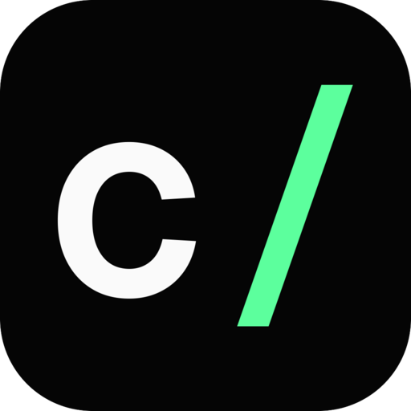
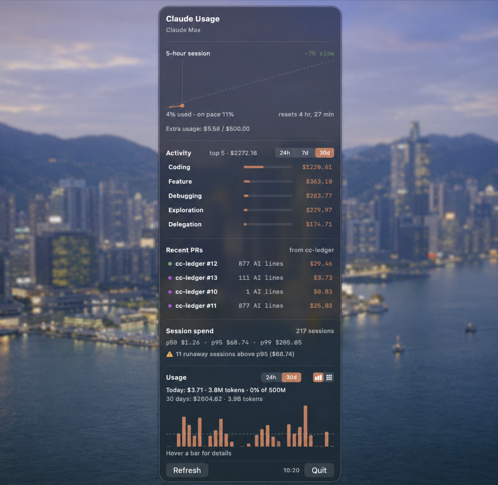
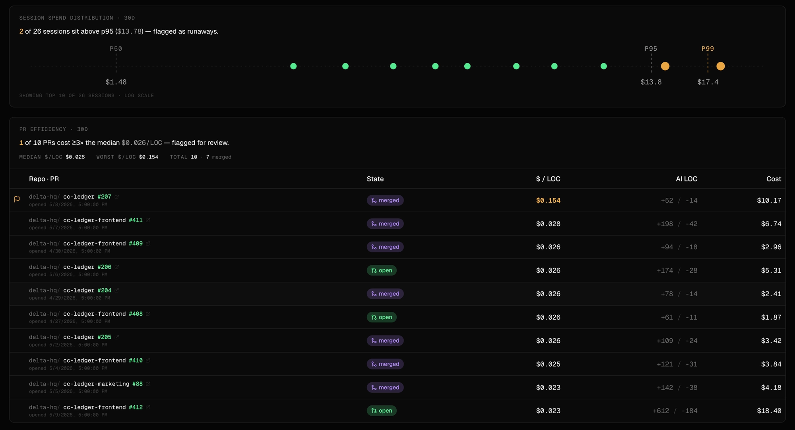

<p align="center">
  
</p>

# cc-ledger

Local-first ledger of coding-agent activity. Every Claude Code edit, prompt, and per-turn token cost is captured via hooks and written to **`~/.cc-ledger/ledger.db`** on your own machine. Pushing aggregates to the cloud dashboard at [ccledger.dev](https://ccledger.dev) is opt-in (`cc-ledger auth` then `cc-ledger sync`); raw prompts, transcripts, and file blobs never leave the laptop.

Phase 1 supports **Claude Code**; the agent layer is abstracted so Cursor / Codex / Amp / OpenCode drop in later.

<div align="center">
<table>
<tr>
<td></td>
<td></td>
</tr>
</table>
</div>

## Install

```bash
curl -fsSL https://ccledger.dev/install | bash
```

Picks the right tarball for your platform (macOS / Linux, x86_64 / aarch64), verifies the SHA256, drops `cc-ledger` into `~/.local/bin`, and runs `cc-ledger install` to wire the Claude Code hooks.

Env overrides: `CC_LEDGER_INSTALL_DIR=…` to change install path, `CC_LEDGER_VERSION=…` to pin a version, `CC_LEDGER_NO_HOOKS=1` to skip the hook step.

After install, open Claude Code. Every session, every edit, every assistant turn now lands in `~/.cc-ledger/ledger.db`.

```bash
cc-ledger stats          # six-panel summary
cc-ledger pr-cost        # cost per PR for the current branch
```

## macOS menubar app

A macOS menubar companion lives in [`menubar/`](menubar/) — same data, glanceable. 5-hour session pacing, active-session breakdown per repo, 24h / 30d usage trend, all reading the local ledger you already have.

```bash
cd menubar
./Scripts/package.sh && open MenuBar.app
```

See [`menubar/README.md`](menubar/README.md) for requirements (macOS 14+, Swift 6) and how to suppress the per-rebuild Keychain prompt.

## Where your data lives

Everything cc-ledger writes lives under one directory — by default `~/.cc-ledger/`, overridable with `CC_LEDGER_HOME`:

```
~/.cc-ledger/
├── ledger.db                     SQLite (WAL mode) — the ledger
├── blobs/<aa>/<bbcc…>            SHA256 content-addressed pre/post file snapshots
├── pricing.toml                  optional override (else uses embedded snapshot)
├── auth.json                     WorkOS tokens, mode 0600 (only after `cc-ledger auth`)
├── auth.lock                     advisory lock for refresh races
├── version-check.json            cached "/latest" lookup for the upgrade banner
└── audit/<session_id>/…          only when CC_LEDGER_AUDIT=1
```

Footprint: ~140 KB per typical session, ~700 KB per heavy session, ~250 MB / year for a daily user.

### Retention

Local data is kept **indefinitely** — cc-ledger never auto-prunes, rotates, or expires anything under `~/.cc-ledger/`. The directory is yours; if you want to wipe history, delete it. To reset only the cloud copy, run `cc-ledger sync --reset-cursor` to re-upload from scratch.

### What's local-only vs synced

| Data | Where it lives | Synced to ccledger.dev (opt-in) |
|---|---|---|
| Prompts + assistant transcripts | `~/.claude/projects/<cwd>/<session>.jsonl` (Claude Code's own log) | ❌ never |
| Tool calls + pre/post file blobs | `~/.cc-ledger/` | ❌ never |
| Audit JSON (`CC_LEDGER_AUDIT=1`) | `~/.cc-ledger/audit/` | ❌ never |
| Session metadata (model, billing, OS) | `~/.cc-ledger/` | ✅ (cwd dropped, repo identity hashed from `git remote`) |
| Per-turn token + USD cost | `~/.cc-ledger/` | ✅ as aggregates |
| Per-line attributions | `~/.cc-ledger/` | ✅ (file paths normalized to repo-relative) |
| Commits / PRs / cost rollups | `~/.cc-ledger/` | ✅ |

cc-ledger does **not** store a duplicate copy of your prompts or assistant turns — Claude Code already writes them verbatim to `~/.claude/projects/<cwd>/<session>.jsonl`, and that's where they stay. Reading prompt history is `cat ~/.claude/projects/.../*.jsonl | jq` away.

`cc-ledger sync` prints exactly which row counts are about to leave the machine and waits for confirmation, unless `--yes` is passed. Sync is also forked in the background (detached, ~15 min cooldown) when you run `stats`, `pr-cost`, or any hook — toggle off with `--no-autosync` or `CC_LEDGER_NO_AUTOSYNC=1`.

If you never run `cc-ledger auth`, nothing ever leaves the machine.

## Commands

```
cc-ledger install              wire hooks into ~/.claude/settings.json
cc-ledger stats                six-panel summary, local read
cc-ledger pr-cost              cost-per-PR for current branch (or --pr / --all)
cc-ledger config [key [value]] read/set local config keys
cc-ledger auth                 device-flow login via WorkOS (subcommands: status, logout)
cc-ledger sync                 push aggregates to ccledger.dev
cc-ledger backfill agent-turns re-classify activity from local Claude Code transcripts
```

Global flags:

| Flag | Effect |
|---|---|
| `--update` | Check for a newer release, install + re-exec into it |
| `--no-autosync` | Skip the opportunistic background sync for this invocation |

### `cc-ledger stats`

Six panels — one question each, defaulting to the last 30 days. Pass `--since 7d` / `--since all` to retarget, `--top N` to cap rows.

| Panel | Question |
|---|---|
| Daily activity | When have I been using it? |
| Top repos | Where am I spending? |
| Top models | Which model is doing the work? |
| Top sessions by token burn | Which sessions are the heavy hitters (and which crossed the p95 runaway threshold)? |
| Session spend distribution | What does a typical session cost vs. how bad does it get? |
| Activity category | What kind of work — coding, debugging, exploration, …? |

### `cc-ledger pr-cost`

Pure-local cost-per-PR view. Recomputes the rollup against the live data and prints a table. `--json` for machine output, `--all` for every PR ever seen in the cwd, `--recompute` to force a fresh recompute.

### `cc-ledger auth` and `cc-ledger sync`

Login is a WorkOS device-authorization flow — opens your browser, polls for the token, writes `~/.cc-ledger/auth.json` (mode 0600). After login:

- `cc-ledger sync` pushes the aggregates listed above. Cursor-based and idempotent on the server, so it's safe to re-run.
- `cc-ledger sync --dry-run` shows what *would* upload without sending.
- `cc-ledger sync --reset-cursor` clears the local cursor — useful after switching orgs or for a fresh laptop.
- A `SessionEnd` hook automatically forks a silent background sync so the dashboard stays close-to-live.
- `cc-ledger auth status` shows the active org and access-token expiry; `cc-ledger auth logout` deletes the token file.

## Cost computation

Every assistant turn computes API-equivalent USD cost from raw token counts and the active pricing table.

- **Five token classes** per turn: `input`, `output`, `cache_read` (0.10× input), `cache_write_5m` (1.25× input), `cache_write_1h` (2× input).
- **Service-tier modifier**: `batch` → ×0.5; `standard` / `priority` pass through.
- **Pricing source order**: `$CC_LEDGER_PRICING` → `~/.cc-ledger/pricing.toml` → embedded snapshot.
- Each turn stores the pricing version it used so historical numbers stay interpretable when prices change.

For subscription users (Pro / Max / Team / Enterprise) the cost field reads "what this would cost on API" — useful as shadow billing. Set `CC_LEDGER_BILLING=pro` (or `api` / `max` / `team` / `enterprise`) to stamp the session accordingly.

The embedded pricing snapshot is verified against [platform.claude.com/docs/en/about-claude/pricing](https://platform.claude.com/docs/en/about-claude/pricing) and covers Opus 4.7 / 4.6 / 4.5 / 4.1 / 4, Sonnet 4.6 / 4.5 / 4 / 3.7, Haiku 4.5 / 3.5, plus legacy Opus 3 / Haiku 3.

## Configuration

All optional — defaults work for the common case.

| Env var | Effect |
|---|---|
| `CC_LEDGER_HOME` | Override `~/.cc-ledger/` (tests, sandboxes) |
| `CC_LEDGER_PRICING` | Path to a pricing TOML override |
| `CC_LEDGER_BILLING` | `api` \| `pro` \| `max` \| `team` \| `enterprise` |
| `CC_LEDGER_AUDIT` | `1` archives every raw hook payload to `<home>/audit/` for forensics |
| `CC_LEDGER_NO_AUTOSYNC` | `1` disables the opportunistic background sync |
| `CC_LEDGER_AUTO_UPDATE` | `1` makes every user-facing invocation behave as if `--update` was passed |
| `CC_LEDGER_NO_UPDATE_CHECK` | `1` suppresses the post-command "new version available" banner |
| `CC_LEDGER_API_BASE` | Override the cloud API base (testing against a local backend) |
| `CLAUDE_CONFIG_DIR` | Where Claude Code's `settings.json` lives |

## Build from source

```bash
cargo build --release
./target/release/cc-ledger install
```

Toolchain is pinned to **Rust 1.85** via `rust-toolchain.toml` — `rustup` installs it automatically the first time.

## License

MIT.
